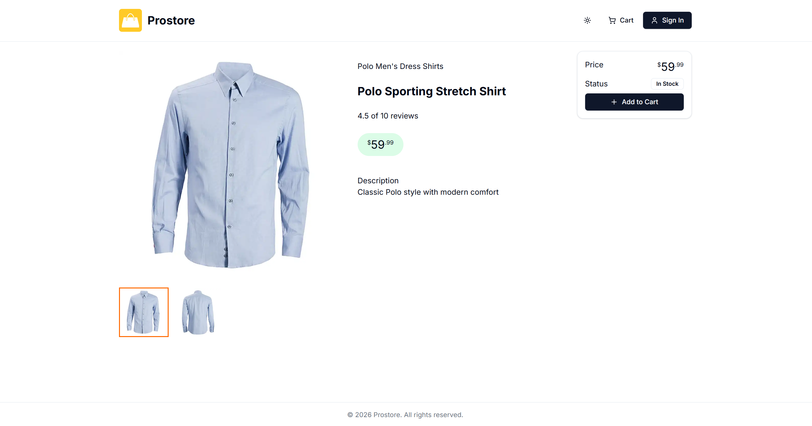

# ProStoreNext

A modern e-commerce frontend built with Next.js.\
The project demonstrates a scalable frontend architecture for an online
store with product listing, product pages, and shopping cart
functionality.

## Overview

ProStoreNext is a modern e-commerce frontend application designed to
showcase best practices in building scalable web applications using
Next.js.

The project focuses on clean architecture, component reusability, and
performance, making it a solid foundation for building production-ready
e-commerce platforms.

## Preview





## Tech Stack

-   Next.js
-   React
-   TypeScript
-   Tailwind CSS
-   REST API integration

## Features

-   Product listing page
-   Product detail page
-   Shopping cart functionality
-   Responsive design
-   Modern UI components
-   Modular component structure

## Project Structure

    src/
    components/      # Reusable UI components
    pages/           # Application pages
    styles/          # Global styles
    utils/           # Helper functions
    public/          # Static assets

The architecture follows a modular approach to keep components reusable
and the codebase maintainable.

## Getting Started

### 1. Clone the repository

``` bash
git clone https://github.com/Michau94/ProStoreNext.git
cd ProStoreNext
```

### 2. Install dependencies

``` bash
npm install
```

or

``` bash
yarn install
```

### 3. Run development server

``` bash
npm run dev
```

The application will start on:

    http://localhost:3000

## Build for Production

``` bash
npm run build
npm run start
```

## Environment Variables

If the project requires external APIs, create a `.env.local` file in the
root directory.

Example:

    NEXT_PUBLIC_API_URL=

## Future Improvements

-   Implement checkout flow
-   Add payment integration
-   Improve product filtering and search
-   Add unit and integration tests

## Author

Michau\
Frontend / Fullstack Developer

GitHub: https://github.com/Michau94
